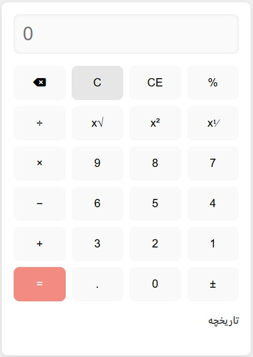

# ماشین حساب پیشرفته

یک ماشین حساب ساده و کاربردی نوشته شده با HTML, CSS و JavaScript که شامل امکاناتی مثل:

- عملیات چهارگانه (جمع، تفریق، ضرب، تقسیم)
- توان، ریشه، درصد
- تاریخچه محاسبات
- پشتیبانی از صفحه‌کلید
- طراحی واکنش‌گرا

## اجرای پروژه

فایل `index.html` را در مرورگر باز کنید.

## پیش‌نمایش

## لایسنس

MIT
