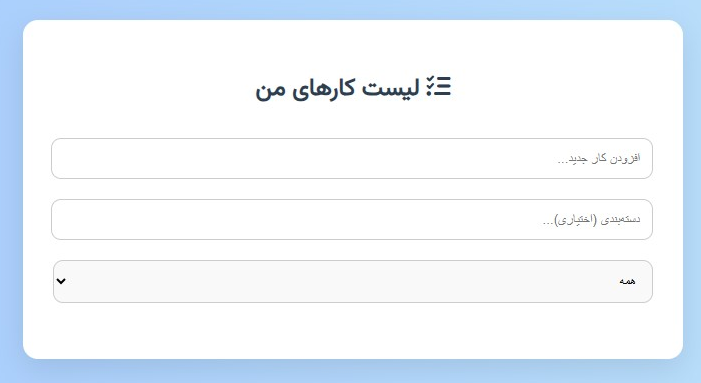

# لیست کارها (To-Do List)

یک برنامه مدیریت لیست کارها با HTML, CSS و JavaScript که به شما امکان اضافه کردن، ویرایش، حذف، فیلتر و دسته‌بندی کارها را می‌دهد.

## امکانات

- افزودن کار جدید با دسته‌بندی دلخواه
- امکان حذف و ویرایش کارها
- علامت‌گذاری کارها به عنوان انجام شده
- فیلتر بر اساس:
  - همه کارها
  - فقط انجام شده‌ها
  - فقط انجام نشده‌ها
- ذخیره‌سازی اطلاعات با استفاده از LocalStorage
- طراحی زیبا، واکنش‌گرا و فارسی
- پشتیبانی از آیکون‌ها با Font Awesome

## اجرای پروژه

کافی‌ست فایل `index.html` را در مرورگر خود باز کنید تا برنامه اجرا شود.

## پیش‌نمایش

## تکنولوژی‌ها

- HTML5
- CSS3
- JavaScript (Vanilla)
- Font Awesome
- Google Fonts (Vazirmatn)

## لایسنس

MIT
